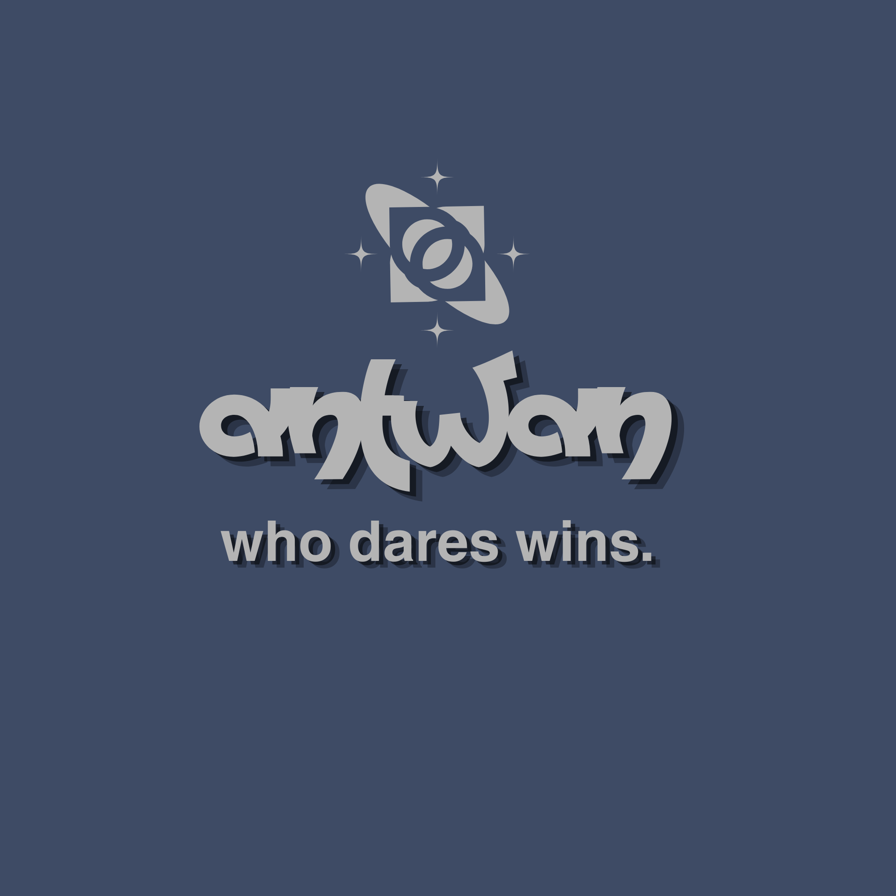
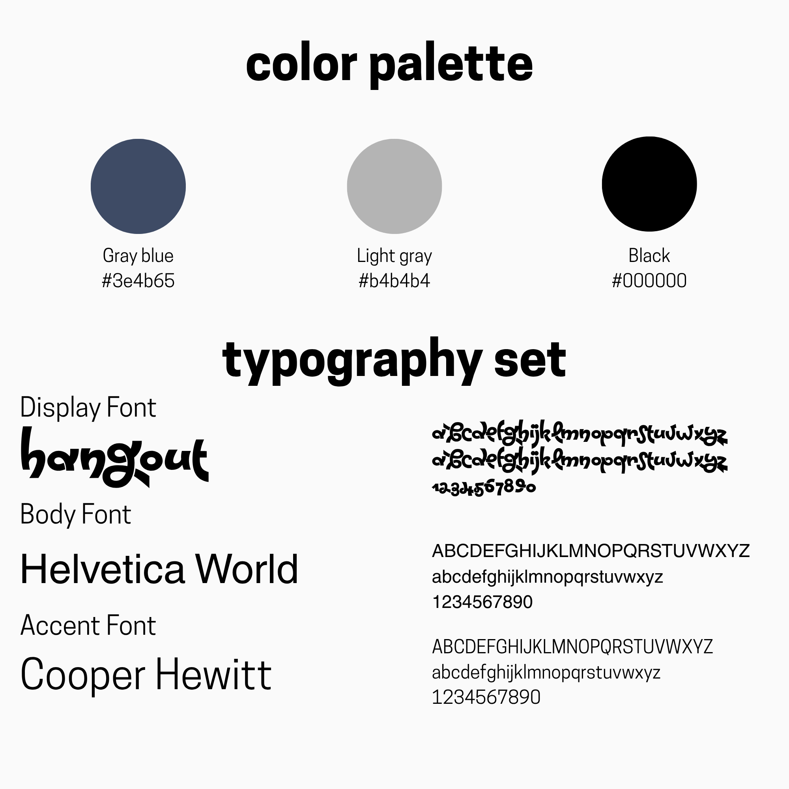

# Activity 2 – Color Palette and Typography

## Overview

This activity focuses on the selection and application of color and typography as elements of visual identity.

The completed outputs include a header, tagline, logo, and color palette and typography set.

---

## Outputs

### Header

---

### Tagline

---

### Logo

---

### Color Palette and Typography Set

The selected color palette consists of:

| Color | Hex Code |
|---|---|
| Gray Blue | `#3e4b65` |
| Light Gray | `#b4b4b4` |
| Black | `#000000` |

The selected typography consists of:

| Role | Typeface |
|---|---|
| Display Font | Hangout |
| Body Font | Helvetica World |
| Accent Font | Cooper Hewitt |

---

## Design Direction

The visual identity uses a limited color palette consisting of gray blue, light gray, and black.

Different typefaces are assigned to display, body, and accent roles to establish distinction and hierarchy between different types of information.

---

## Reflection

This activity provided an opportunity to explore how color and typography can work together to establish a consistent visual identity.

The process demonstrated how selecting appropriate colors and typefaces can contribute to the overall appearance and organization of a design.

---

## Files

[View Header](./HEADER_ZARAGOZA.png)

[View Tagline](./TAGLINE_ZARAGOZA.png)

[View Personal Logo](./PERSONAL%20LOGO_ZARAGOZA.png)

[View Color Palette and Typography Set](./COLORTYPOGRAPHY_ZARAGOZA.png)
